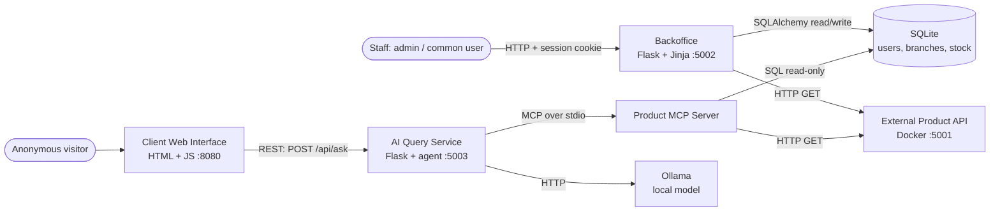

# HBntory - Architecture

## 2. Service diagram 

```mermaid
flowchart LR
    Staff([Staff: admin / common user]) -->|HTTP + session cookie| BO[Backoffice<br>Flask + Jinja :5002]
    Visitor([Anonymous visitor]) --> CW[Client Web Interface<br>HTML + JS :8080]
    CW -->|REST: POST /api/ask| AI[AI Query Service<br>Flask + agent :5003]
    AI -->|MCP over stdio| MCP[Product MCP Server]
    AI -->|HTTP| LLM[Ollama<br>local model]
    BO -->|SQLAlchemy read/write| DB[(SQLite<br>users, branches, stock)]
    MCP -->|SQL read-only| DB
    BO -->|HTTP GET| API[External Product API<br>Docker :5001]
    MCP -->|HTTP GET| API
```